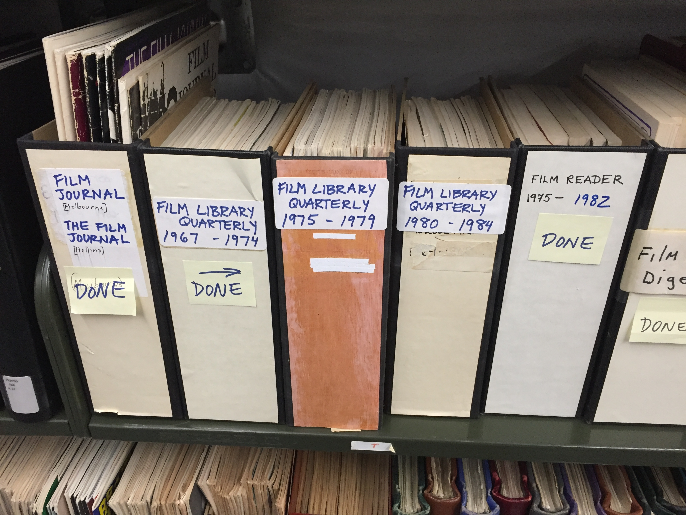

## This is a Python script to compare a list of titles known to be in the BAMPFA film library offsite storage facility against the UC Berkeley's catalog output of all our serial holdings. 

With the 2015 BAMPFA building move, our library holdings are split between onsite and offsite, with the onsite materials selected by our reference librarian. It was simple enough to make a list of **titles** in the offsite facility, but since we need to update a few thousand item records, using this approach we can take the list of ~100 titles and come up with a detailed list of individual periodical issues \(about 4000\) that need to swap from our main site to our storage site in [Oskicat](http://oskicat.berkeley.edu/search~S43/X?SEARCH=(*)&SORT=D&j=s). This script just generates a list of offsite items, and will be handed to the UCB library systems office to do the bulk update \(we don't have acces to that hi-sec stuff\).

### Here's what's involved:
- The output from the UCB Millennium ILS included for each item: 
    1) the item record number
    2) the holding record number \(one number per PFA title\)
    3) the MARC 022 field AKA ISSN [\(International Standard Serial Number\)](https://en.wikipedia.org/wiki/International_Standard_Serial_Number) \(if there is one\)
    4) the item barcode number
    5) the MARC 245$a title
    6) the MARC 130 Uniform title \(if there is one\)
- The hand-made list of our offsite stuff included for each title:
    1) the 245$a as found in Oskicat
    2) the ISSN as found in Oskicat \(if there is one\)
    3) the MARC 130 Uniform title as found in Oskicat \(if there is one\)
    4) a unique ID I made up that I didn't end up using :/

These output files gets compared using ISSN, 245$a, and 130 fields, and matches are output into a new file that gets deduped \(since the three comparison steps make some overlap\) that I'll hand to the systems office.

### Next steps/ what I would like to have done differently

I made the list of titles based on handwritten titles on pamphlet boxes on the shelves in storage.  I had to do a lot of correcting titles, spellings, punctuation, etc. in order to find the right 245$a to match on. Titles like "Video," "Film," etc. were a real pain. Since I was already in Oskicat it was simple enough if tedious to copy and paste the 245/130/022 values into my list. But provided I could have gotten a better-controlled list of titles, next time I would try to webscrape Oskicat to gather 130 and 022 fields to simplify that process. 

I had to program in the deduping. Shoulda found a way to make the match processes unique/not overlap to begin with. Oh well.

I had to do some cleanup of the Millennium export since a few records inexplicably shifted some fields over. I had to open the export, sort by something like the barcode value, and manually copy/paste the offending columns over. Not sure if it's a Millennium indexing issue, but it was annoying.  :)